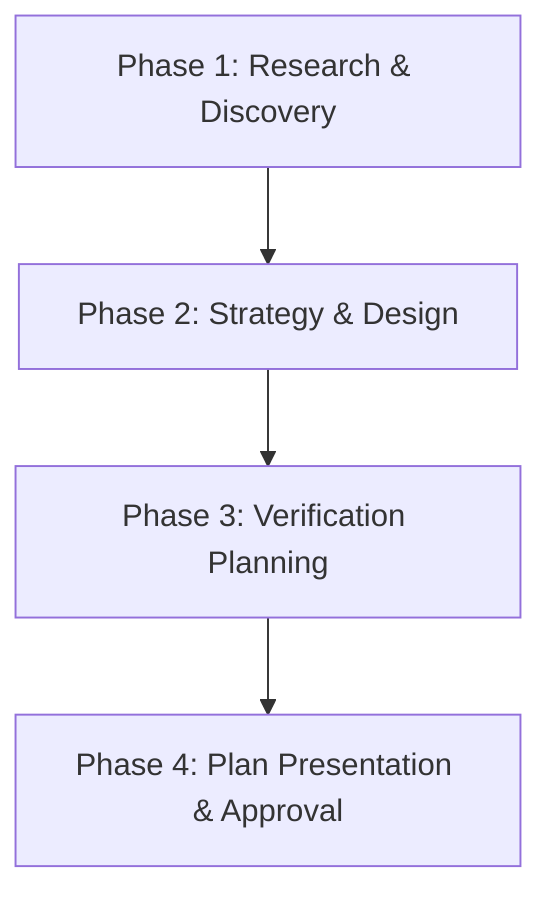

# Plan Mode

This skill defines the rigorous, structured planning and design process that Gemini CLI follows before initiating any codebase changes, implementing new features, or refactoring complex logic.

## 📋 The Planning Workflow

When the user requests a plan or when you identify a complex task requiring research and architectural design, follow this 4-step workflow:



### Phase 1: Research & Discovery (Read-Only)
- Use read-only tools (`grep_search`, `glob`, `read_file`) to inspect the workspace.
- Identify existing code patterns, dependencies, file structures, and technical constraints.
- **Empirical Reproduction**: If planning a bug fix, first determine how the issue can be reproduced locally via test cases or scripts.

### Phase 2: Strategy & Design
- Formulate the technical solution. Align strictly with established project conventions (e.g., Next.js App Router, Tailwind v4, Google Sheets backend).
- Propose specific database schema changes, new API endpoints, or component structures.
- Detail any potential side effects or breaking changes.

### Phase 3: Verification & Test Planning
- Design the validation strategy *before* writing code.
- List the automated tests (`jest`, `playwright`, etc.) that need to be created or updated.
- Specify manual verification steps (e.g., starting local dev server and testing specific routes/flows).

### Phase 4: Plan Presentation
- Present the structured plan to the user.
- **Strict Constraint**: Stop and wait for the user's explicit approval or feedback before executing any part of the plan.

---

## 📝 Structured Plan Template

When presenting your plan, always use the following Markdown template to ensure high-signal communication:

```markdown
# 🗺️ Execution Plan: [Task Title]

## 🔍 1. Research Summary & Findings
- **Current State**: Brief analysis of the existing codebase.
- **Identified Bottlenecks/Issues**: What needs to be solved.
- **Reproducible Test**: How we will prove the bug/feature works.

## 🛠️ 2. Proposed Changes & Architecture
- **Files to Modify**: Exact list of paths.
- **Files to Create**: Any new components, routes, or helper utilities.
- **Tech Stack Compliance**: How this change complies with `GEMINI.md` and local conventions.

## 🧪 3. Verification & Testing Strategy
- **Automated Tests**: Unit/integration tests to add/modify.
- **Manual QA Plan**: Steps to verify the change locally (e.g., via browser or curl).

## 📅 4. Step-by-Step Milestones
- [ ] **Milestone 1**: Research & Setup.
- [ ] **Milestone 2**: Code modifications.
- [ ] **Milestone 3**: Automated testing & Lint/Type checks.
- [ ] **Milestone 4**: Final QA validation using Playwright.
```

---

## 🤖 Agent Instructions for Plan Mode

- **Never write code during planning**: Do not use `write_file` or `replace` to modify codebase files while in this mode.
- **Stay Focused**: Propose the simplest, most elegant solution. Avoid speculative refactorings or "just-in-case" changes.
- **Seek Clarification**: If requirements are underspecified, present 2-3 specific options to the user with pros/cons and ask for their preference.
- **Wait for Signal**: End the response by asking: *"Would you like me to proceed with this plan, or do you have any adjustments?"*
