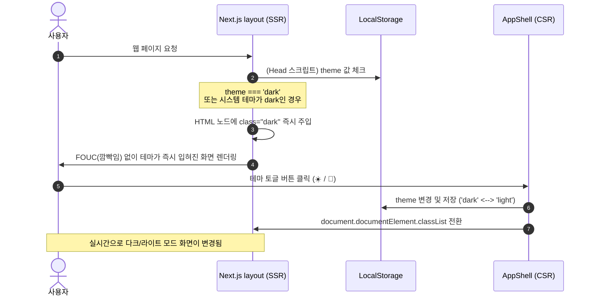

# 다크모드 적용 기획 및 구현 계획서 (Dark Mode Implementation Plan)

본 문서는 검암중앙교회 재정관리 시스템(Next.js 16.2.9 + Tailwind CSS v4)에 다크모드를 안정적으로 구현하고 현대적이며 일관성 있는 UX를 제공하기 위한 분석 및 기획서입니다.

---

## 1. 다크모드 구현 목적 및 방향성

### 1.1 구현 목적
- **피로도 감소**: 야간 또는 장시간 재정 데이터 입력/조회 시 사용자의 시각적 피로를 대폭 경감합니다.
- **현대적인 미감**: 시스템 전반의 미감을 높이고 현대적인 어두운 테마 UI를 제공합니다.
- **선택권 부여**: 기기의 시스템 테마 또는 사용자의 명시적인 수동 설정을 모두 존중합니다.

### 1.2 기술적 지향점
- **깜빡임 현상(FOUC) 차단**: 페이지 최초 로딩 시 라이트 모드 테마가 아주 잠깐 보이는 현상을 완전 차단하기 위해 `layout.tsx` 내에 인라인 스크립트를 삽입합니다.
- **Tailwind CSS v4 최적화**: Tailwind v4의 CSS-first 철학에 부합하도록 `@variant dark (&:where(.dark, .dark *));` 방식을 사용하여 클래스(`class="dark"`) 기반 수동 다크모드를 활성화합니다.
- **Surgical Edit (수술식 수정)**: 불필요하게 전체 클래스를 치환하는 대신, 레이아웃 쉘 및 핵심 공통 컴포넌트를 정교하게 수정하여 코드 변경 범위를 최소화하면서 높은 효과를 냅니다.

---

## 2. 기술 분석 및 설정 (Tailwind v4)

### 2.1 CSS-first 다크모드 활성화
Tailwind CSS v4 에서는 `tailwind.config.js`가 없으므로 `src/app/globals.css` 파일에 직접 다크모드용 커스텀 베리언트를 추가합니다.

```css
@import "tailwindcss";

/* Tailwind v4 클래스 기반 다크모드 베리언트 활성화 */
@variant dark (&:where(.dark, .dark *));

:root {
  --background: #ffffff;
  --foreground: #171717;
}

@theme inline {
  --color-background: var(--background);
  --color-foreground: var(--foreground);
  --font-sans: var(--font-geist-sans);
  --font-mono: var(--font-geist-mono);
}
```

이렇게 구성하면 HTML 상위에 `.dark` 클래스가 주입되었을 때 하위 요소들에서 `dark:...` 유틸리티 클래스가 정상 활성화됩니다.

---

## 3. 테마 상태 관리 및 깜빡임 방지 (FOUC Block)

### 3.1 `layout.tsx` FOUC 방지 인라인 스크립트
서버 사이드 렌더링(SSR) 환경에서 초기 테마 상태(`theme=dark`)를 감지하기 전에 화면이 하얗게 깜빡이는 현상을 해결합니다. HTML `<head>` 영역에 아래 스크립트를 즉시 실행 함수(IIFE) 형태로 실행하여 클라이언트 렌더링 시작 전 `html` 노드에 `dark` 클래스를 즉시 반영합니다.

```html
<script
  dangerouslySetInnerHTML={{
    __html: `
      (function() {
        try {
          const theme = localStorage.getItem('theme');
          if (theme === 'dark' || (!theme && window.matchMedia('(prefers-color-scheme: dark)').matches)) {
            document.documentElement.classList.add('dark');
          } else {
            document.documentElement.classList.remove('dark');
          }
        } catch (_) {}
      })()
    `
  }}
/>
```

### 3.2 `AppShell.tsx` 내 테마 토글 버튼 추가 및 상태 공유
사이드바 하단 또는 헤더 우측 영역에 테마 변경 버튼을 구성합니다.
- `localStorage`에 테마 상태(`theme=dark` / `theme=light`)를 기록합니다.
- React 컴포넌트 생명주기와 동기화하기 위해 마운트(`useEffect`) 후 현재 테마 상태를 React State로 바인딩하여 UI에 표기합니다 (Hydration 에러 방지).

---

## 4. 컴포넌트별 다크모드 마이그레이션 가이드

전체 시스템에서 아래와 같이 시각적 대비를 제공하는 어두운 테마 전용 색상들을 매핑합니다.

| 분류 | 라이트 테마 클래스 | 다크 테마 대응 클래스 | 역할 |
|---|---|---|---|
| **기본 배경** | `bg-gray-50` | `dark:bg-gray-950` | 전체 화면 및 본문 배경색 |
| **카드/컨테이너** | `bg-white` | `dark:bg-gray-900` | 컴포넌트, 폼, 사이드바, 헤더, 테이블 배경 |
| **테두리선 (연한)** | `border-gray-100` | `dark:border-gray-800` | 일반 구분선, 카드 경계선 |
| **테두리선 (진한)** | `border-gray-200` | `dark:border-gray-700` | 입력 인풋 테두리, 주요 구획선 |
| **주 텍스트** | `text-gray-900` | `dark:text-gray-100` | 타이틀, 데이터 텍스트 |
| **보조 텍스트** | `text-gray-600` | `dark:text-gray-300` | 레이블, 설명, 일반 글자 |
| **흐린 텍스트** | `text-gray-400` / `500` | `dark:text-gray-500` | 비활성 데이터, 세부 주석 |
| **호버링 배경** | `hover:bg-gray-50` / `100` | `dark:hover:bg-gray-800` | 리스트/버튼 호버 |

### 4.1 `AppShell.tsx` 수정 포인트
- 모바일 상단 헤더: `bg-white border-b border-gray-100` -> `dark:bg-gray-900 dark:border-gray-800`
- 데스크톱 접기 열기 버튼: `bg-white border border-gray-200 text-gray-600` -> `dark:bg-gray-900 dark:border-gray-700 dark:text-gray-300`
- 사이드바 네비게이션 컨테이너: `bg-white border-r border-gray-100` -> `dark:bg-gray-900 dark:border-gray-800`
- 네비게이션 링크 (비활성): `text-gray-600 hover:bg-blue-50 hover:text-blue-700` -> `dark:text-gray-300 dark:hover:bg-blue-950/40 dark:hover:text-blue-400`
- 네비게이션 링크 (활성): `bg-blue-50 text-blue-700` -> `dark:bg-blue-950/40 dark:text-blue-400`
- 테마 토글 버튼: 해와 달 아이콘(☀️ / 🌙) 또는 직관적인 텍스트 버튼으로 구현하여 사이드바 하단 `LogoutButton` 근처에 배치.

### 4.2 공통 UI 요소 수정 포인트
- **`PaginatedTable.tsx`**:
  - 검색 인풋 및 셀렉트: `bg-white border-gray-200` -> `dark:bg-gray-900 dark:border-gray-700 dark:text-gray-200`
  - 테이블 컨테이너: `bg-white border border-gray-100` -> `dark:bg-gray-900 dark:border-gray-800`
  - 테이블 헤더 (`th`): `bg-gray-50 text-gray-500 hover:text-gray-700` -> `dark:bg-gray-800/50 dark:text-gray-400 dark:hover:text-gray-200`
  - 테이블 바디 로우 (`tr`): `divide-y divide-gray-50` -> `dark:divide-gray-800`
  - 합계 행 및 페이징 버튼들 다크모드 완벽 반영.
- **필터 콤보 컴포넌트** (`DateFilter.tsx`, `HalfFilter.tsx`, `MonthFilter.tsx`, `YearFilter.tsx` 등):
  - 각 필터 버튼들: `bg-white border-gray-200` -> `dark:bg-gray-900 dark:border-gray-700 dark:text-gray-200`
  - 호버 및 선택 상태 테두리와 텍스트 색상 다크모드 대응.
- **피벗 테이블 및 대시보드 그리드** (`PivotGrid.tsx`, `StatusPivot.tsx`, `SummaryPivot.tsx` 등):
  - 격자형 데이터 배경 및 경계선에 다크모드 스타일링 적용하여 표가 묻히거나 번쩍이지 않게 조정.

### 4.3 폼 및 입력 필드 수정 포인트
- **`MemberForm.tsx`**, **`OfferingForm.tsx`**, **`ExpenseForm.tsx`**:
  - 인풋 상자들: `bg-white border-gray-200 focus:ring-blue-500` -> `dark:bg-gray-900 dark:border-gray-700 dark:text-gray-100 dark:focus:ring-blue-400`
  - 제안 목록 팝업 (`SuggestInput.tsx`, `Combobox.tsx` 등): `bg-white border-gray-200` -> `dark:bg-gray-900 dark:border-gray-700 dark:text-gray-100`

---

## 5. 구현 단계별 실행 계획 (Roadmap)

### [Phase 1: 기획 및 설정]
- `globals.css` 파일 수정하여 Tailwind v4 `@variant dark` 설정 완료.
- `layout.tsx` 의 `<head>` 영역에 FOUC 방지 차단용 인라인 스크립트 작성.

### [Phase 2: 쉘 & 테마 전환 기능 구현]
- `AppShell.tsx` 컴포넌트 내에 `useState`, `useEffect`를 사용한 테마 관리 로직 개발.
- 다크모드와 라이트모드를 수동으로 전환하는 우아한 테마 토글 버튼 구현 및 사이드바 내 배치.
- `AppShell.tsx` 내의 헤더, 사이드바, 링크 배경/글자 색상들에 다크모드 클래스(`dark:...`) 전면 적용 및 확인.

### [Phase 3: 핵심 테이블 및 데이터 그리드 적용]
- 가장 자주 노출되는 `PaginatedTable.tsx`를 전면 수정하여 다크모드에서 수려한 표 데이터 시각화 보장.
- `PivotGrid.tsx` 및 각 집계표 피벗 컴포넌트의 다크모드 조밀 적용.

### [Phase 4: 입력 폼 및 세부 컴포넌트 마이그레이션]
- 헌금/지출 입력 폼과 교인 정보 폼 등 데이터를 저장하는 주요 폼의 테두리, 배경, 셀렉트 박스 다크모드 적용.
- `AmountInput`, `Combobox`, `SuggestInput` 등 전용 UI 컴포넌트의 가시성 개선.

### [Phase 5: 빌드 및 종합 검증]
- `npm run build` 및 `npx tsc --noEmit`을 실행하여 빌드 및 타입 안정성 검증.
- `npm run lint`를 실행하여 린트 오류 사전 차단.

---

## 6. 시각화 자료 (Architecture & Theme Flow)



---
파일이 `docs/ai_analysis/20260703_Dark_Mode_Implementation_Plan.md`에 저장되었습니다.
