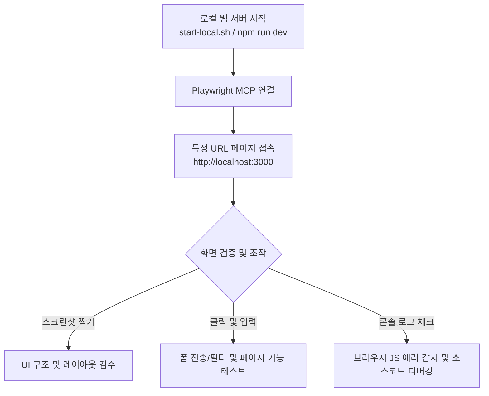

생성일: 2026-07-03
관련 프로젝트: church_finance (교회 재정 관리 앱)
작성자: Gemini CLI
신뢰도: 높음
분석 대상: 브라우저 자동화 기반 QA를 위한 MCP(Model Context Protocol) 환경 설정

## 📌 TL;DR
- 수석 QA 에이전트 역할을 완벽하게 수행하기 위해 브라우저를 직접 띄우고 테스트할 수 있는 **Playwright MCP 서버**를 연동하였습니다.
- 프로젝트 로컬 설정 파일(`.gemini/settings.json`)에 등록이 완료되었으며, 이를 통해 로컬 웹 서비스를 띄운 후 화면 검증, 클릭, 스크린샷, 콘솔 로그 감지 등의 QA 작업을 지능적으로 수행할 수 있습니다.

## 설정 상세

### ① Playwright MCP 서버 등록
- 공식적으로 권장되는 최신 브라우저 자동화 MCP 패키지인 `@modelcontextprotocol/server-playwright`를 프로젝트 스코프에 추가하였습니다.
- 등록 커맨드: `gemini mcp add --scope project playwright npx -y @modelcontextprotocol/server-playwright`

### ② 설정 파일 구조 (`.gemini/settings.json`)
```json
{
  "mcpServers": {
    "playwright": {
      "command": "npx",
      "args": [
        "-y",
        "@modelcontextprotocol/server-playwright"
      ]
    }
  }
}
```

---

## 🚀 로컬 QA 테스트 시나리오 가이드

수석 검수 에이전트로서 앞으로 화면 및 로컬호스트 검증 시 다음 절차를 밟아 테스트를 수행합니다.



### 1. 웹 앱 시작 및 모니터링
- 백그라운드 프로세스로 로컬 Next.js 개발 서버를 실행시킵니다.
  ```bash
  npm run dev
  ```
- 서비스가 정상 구동되면 Playwright MCP 서버를 활성화하여 브라우저 인스턴스를 제어합니다.

### 2. Playwright 주요 연동 도구 활용
- **페이지 이동 (Navigate)**: `http://localhost:3000`에 접속하여 메인 대시보드 로딩 상태를 확인합니다.
- **인라인 조작 (Interaction)**: 지출, 헌금 등의 신규 입력 폼에 텍스트 입력 및 드롭다운 선택 테스트를 실행합니다.
- **콘솔 에러 디버깅**: 리액트 렌더링 에러나 API 통신 오류 발생 시 실시간으로 콘솔 로그를 수집하여 디버깅합니다.

## 📝 변경 이력
| 날짜 | 변경 내용 |
|------|----------|
| 2026-07-03 | 최초 작성 — Playwright MCP 서버 설정 완료 및 검수 프로세스 구조화 |
